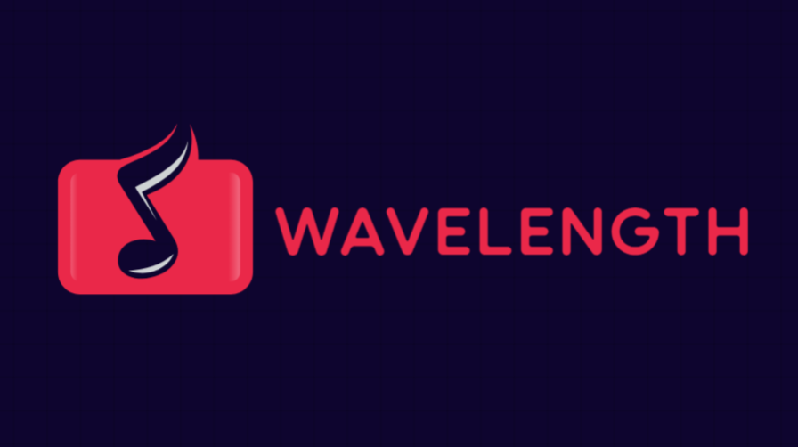

# 🎧 Wavelength – Natural Language Music Recommendations

Wavelength is an AI-powered web app that generates tailored music recommendations from natural language prompts like:

> “Energetic indie tracks with summery vibes that help me focus.”

Built with Python, Streamlit, and the Last.fm API, the app interprets your intent and returns relevant songs — not just by genre or mood, but by *vibe*.

---

## ✨ Key Features

- 🧠 **Natural Language Input** – Describe what you're in the mood for, just like you’d tell a friend.
- 🎵 **Real-Time Music Recommendations** – Get tracks that match your request using Last.fm metadata.
- 🔍 **LLM-Powered Prompt Interpretation** – A local or hosted language model interprets your prompt and turns it into a smart search query.
- 📊 **Clean, Intuitive UI** – Built with Streamlit for rapid interaction and instant feedback.
- 📈 **Modular Backend** – FastAPI handles routing, model communication, and logging.

---

## ⚙️ Tech Stack

- **Python** – Core app and logic  
- **Streamlit** – Frontend interface  
- **FastAPI** – Backend API for routing and logging  
- **Last.fm API** – Artist and track metadata  
- **Ollama** – Used during development for LLM inference (deployment options in progress)  
- **Requests** – For API interaction  

---

## 💡 Project Goals

- Create a more expressive and intuitive way to discover music using natural language.
- Explore how generative AI can enhance recommender systems.
- Build a functional, lightweight MVP showcasing LLM + API integration.

---

## 🚧 Current Status

The app is mostly developed. Model hosting and API deployment are being finalised before public release. Once ready, a live demo will be made available for testing and feedback.

<!--
---

## 📦 Installation (for local testing)

> 🔐 You'll need a Last.fm API key to run the app.

```bash
git clone https://github.com/yourusername/wavelength.git
cd wavelength
pip install -r requirements.txt
streamlit run app.py
-->
